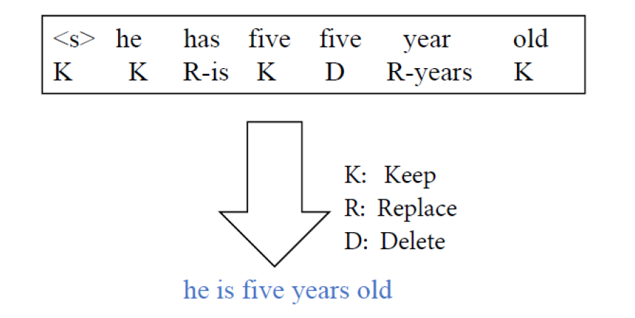

# Seq2Edits: a sequence-to-edit model for Grammer Error Correction

## One-Sentence Summary

This project proposes Seq2Edits, a novel model that considers the grammar error correction task as a sequence labeling problem. An illustration is depicted below:

